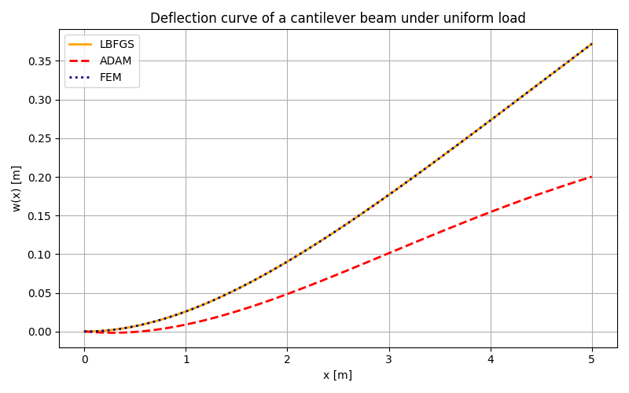
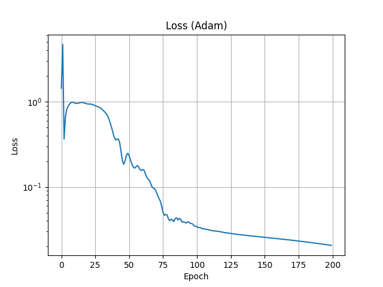

<div class="titlepage">

------------------------------------------------------------------------

**The Euler-Bernoulli Beam Equation and Physics Informed Neural Networks (PINN)**

------------------------------------------------------------------------

Robert Haas

(current page.south west) rectangle (\[yshift=3cm\]current page.south east);

2025-07-04

</div>

# The Euler-Bernoulli Equation of a Beam

For studying the bending behavior of a beam we consider a beam with the following assumptions:

1.  The beam under consideration is a cantilever beam: At one end the beam is fixed in that way, that there is no displacement and no rotation allowed. At the other end -the free end- displacement and rotation may occur.

2.  The beam has a fixed constant cross-section.

3.  Hooke’s law, i.e. the stress $`\sigma`$ is proportional to the strain $`\epsilon`$, is fulfilled everywhere.

The Euler-Bernoulli equation is given by
``` math
\label{PrincipalEulerBernoulli}
\frac{N{d}^2}{N{d}x^2}\left( E (x) \cdot I \cdot \frac{N{d}^2 w(x)}{N{d}x^2} \right) = q \text{ for } x \in (0,L) .\\
```
With constant elastic modulus $`E`$ this simplifies to
``` math
\label{PrincipalEulerBernoulliConstantE}
E\cdot I \cdot \frac{N{d}^4 w(x)}{N{d}x^4} = q \text{ for } x \in (0,L)\\
```
subject to the boundary conditions
``` math
\label{PrincipalBoundaryConditions}
w( 0) = \frac{N{d} w}{N{d}x}(0) = 0 \text{ , and } \frac{N{d}^2 w}{N{d}x^2}(L) = \frac{N{d}^3 w}{N{d}x^3}(L) = 0.
```
The physical quantities in equation (<a href="#PrincipalEulerBernoulli" data-reference-type="ref" data-reference="PrincipalEulerBernoulli">[PrincipalEulerBernoulli]</a>) are described in the following table.

<div id="TableTypicalValues">

| **Symbol** | **SI Unit** | **Description** | **Typical Value** |
|:--:|:--:|:---|:--:|
| $`L`$ | $`N{m}`$ | Length | $`5\; N{m}`$ |
| $`w`$ | $`N{m}`$ | Deflection | $`w<< L`$ |
| $`E`$ | $`N{Pa}`$ | Elastic modulus (Young’s modulus) | $`210\;000\; N{N}VsSquareMillimeter`$ |
| $`I`$ | $`N{m}^4`$ | Second moment of area | $`10^{-6}\;N{m}^4`$ |
| $`q`$ | $`N{N}VsMeter`$ | Distributed load | $`1000 \;N{N}VsMeter`$ |

Physical quantities.

</div>

Unless otherwise stated we consider the Euler-Bernoulli equation (<a href="#PrincipalEulerBernoulliConstantE" data-reference-type="ref" data-reference="PrincipalEulerBernoulliConstantE">[PrincipalEulerBernoulliConstantE]</a>), i.e. the variant with constant elastic modulus $`E`$. For this case an exact solution is given by
``` math
w(x) = \frac{q}{24 E\cdot I }\cdot x^2 \cdot \left( x^2 -4L\cdot x + 6L^2\right) .
```
With the values given in Table <a href="#TableTypicalValues" data-reference-type="ref" data-reference="TableTypicalValues">1</a> we get
``` math
\label{MaximalDeflection}
w( L) = \frac{q}{24 E\cdot I }\cdot L^2 \cdot \left( L^2 -4L\cdot L + 6L^2\right) = \frac{q\cdot L^4}{8 E\cdot I } \approx 0.37202 \text{ m},
```
which is the deflection of the beam at position $`x = L`$.

Following a dimensionless form of the equation (<a href="#PrincipalEulerBernoulli" data-reference-type="ref" data-reference="PrincipalEulerBernoulli">[PrincipalEulerBernoulli]</a>) can be derived to give
``` math
\label{DimensionlessEulerBernoulli}
% \frac{\mathrm{d}^2}{\mathrm{d}\xi^2}\left( e(\xi ) \frac{\mathrm{d}^2 v(\xi)}{\mathrm{d}\xi^2} \right)  = 1 \text{ or } 
\frac{N{d}^4 v(\xi)}{N{d}\xi^4} = 1 \text{ for } \xi \in (0,1),\\
```
where
``` math
\begin{aligned}
E (x) &=& E_{N{char}} \cdot e(\xi ) , \\
w(x) &=& w_{N{char}} \cdot v(\xi ) , \\
x &=& \xi\cdot L, \\
w_{N{char}} & = & \frac{q\cdot L^4}{E\cdot I }, \\
\frac{N{d}^4 w(x)}{N{d}x^4} & = & \frac{w_{N{char}}}{L^4}\cdot \frac{N{d}^4 v(\xi)}{N{d}\xi^4}.
\end{aligned}
```
Here $`E_{N{char}}`$ may be chosen as
``` math
E_{N{char}} = N{max}_{x\in \lbrack 0,1 \rbrack } E(x) .
```
The boundary conditions now read as
``` math
\label{DimensionlessBoundaryConditions}
v( 0) = \frac{N{d} v}{N{d}\xi }(0) = 0 \text{ , and } \frac{N{d}^2 v}{N{d}\xi^2}(1) = \frac{N{d}^3 v}{N{d}\xi^3}(1) = 0.
```
Again, there exists an exact solution, given by
``` math
v(\xi ) = \frac{1}{24} \cdot \xi^2 \cdot \left( \xi^2 -4 \xi + 6 \right) .
```
The equation (<a href="#DimensionlessEulerBernoulli" data-reference-type="ref" data-reference="DimensionlessEulerBernoulli">[DimensionlessEulerBernoulli]</a>) is crucial for the application of some numerical methods, e.g. physics informed neural networks (PINN).

## The Finite-Element Method (FEM) for solving the Euler-Bernoulli Equation

The FEM is set up for the the dimensionless problem (<a href="#DimensionlessEulerBernoulli" data-reference-type="ref" data-reference="DimensionlessEulerBernoulli">[DimensionlessEulerBernoulli]</a>) and the boundary conditions (<a href="#DimensionlessBoundaryConditions" data-reference-type="ref" data-reference="DimensionlessBoundaryConditions">[DimensionlessBoundaryConditions]</a>). Here, classical 1D beam elements (third order Hermite polynomials) on 99 elements are used to solve this equation. The theory on FEM to solve the Euler-Bernoulli equation can be found in any good text book.
The results of the calculation will be shortly presented in Table <a href="#ComparisonFwdProblem" data-reference-type="ref" data-reference="ComparisonFwdProblem">2</a>.

# The Idea of a Physics Informed Neural Network (PINN)

Neural Networks are usually used for either for *classification* or *approximation*. A short introduction to neural networks can be found in and for example. Today the main applications of neural networks contain classification. On the other hand, neural networks can be used to approximate an (unknown) function $`u`$. If this function $`u`$ arises from a physics or engineering context, i.e. from a mathematical equation of physics the equation structure will be incorporated into the neural network or the learning algorithm in some way. In this case the neural network is often called *phyiscs informed neural networks (PINN)*. Here the key task is to construct an approximation $`\hat{u}`$ for the unknown $`u`$. Assuming there is a PINN of $`n`$ layers then the output $`O_{(k)}`$of layer $`k`$ is connected to the output $`O_{(k-1)}`$ of layer $`k-1`$ via
``` math
O^{(k)}_i = f^{(k-1)}\left( b^{(k-1)}_i + \sum_j \theta^{(k-1)}_{i,j} O^{(k-1)}_j \right),
```
where $`O^{(k-1)}_j`$ is the output of the $`j`$-th node in layer $`k-1`$, $`\theta^{(k-1)}_{i,j}`$ is the weight of the connection between the $`j`$-th node in layer $`k-1`$ and the $`i`$-th node in layer $`k`$, $`b^{(k-1)}_i`$ is the bias neuron of $`i`$-th node in layer $`k-1`$ and $`f^{(k-1)}`$ is the activation of the nodes of layer $`k-1`$.

For a function $`v`$ of one variable and a PINN with only one hidden layer and $`f^{(2)} = 1`$ the approximation task is to find weights $`\theta`$ and a bias neuron $`b`$ such that
``` math
\hat{v} (\xi) =   b_1^{(2)} + \sum_j \theta^{(2)}_j f^{(1)}\left( b_j^{(1)} + \theta_1^{(1)} \xi \right).
```
This illustrates that the unknown function $`v`$ is essentially approximated by a linear combination of the activation functions whereas the numbers $`b_j^{(1)}`$, $`b_1^{(2)}`$, $`\theta_1^{(1)}`$ and $`\theta^{(2)}_j`$ are adjusted by the backpropagation algorithm to minimise $`\sum_{j=1}^N\| \hat{v} (\xi_j) - v(\xi_j) \|^2`$, for example.

There are two important application cases where PINNs are applied to:

- Solving a set of mathematical equations. This is called the *direct problem*. The set of mathematical equations is usually a set of differential equations and their boundary conditions. These differential equations can be either ordinary or partial differential equations.

- Estimation of an unknown parameter in the set of mathematical equations where its solution is given by simulated measured values for example. This is called the *inverse problem*.

Typically neural networks learn by minimising a loss function. A key concept in PINN is to extend the loss function by a term that penalizes deviations from the governing equations and the boundary conditions.

Mathematical equations in engineering or physics are often of the form
``` math
\begin{aligned}
\mathscr{A} (v) &=& 0,\text{ in the domain,} \\
\mathscr{B} (v) &=& 0,\text{ on the boundary. }
\end{aligned}
```
In most cases, $`\mathscr{A}`$ is a differential operator either for an ODE or a PDE. Then, $`\mathscr{B}`$ is the boundary operator. For the direct problem the function typically consists of
``` math
\begin{aligned}
 \label{LossTerm1}
\text{Physics loss } &=& \mathscr{L}_{N{Physics}} (\hat{v}) =\beta \sum_{k = 1}^N\| \mathscr{A} (\hat{v}(\xi_k) ) \|^2 \\
\text{Boundary loss} &=& \mathscr{L}_{N{Boundary}} (\hat{v}) = \beta \sum_{k = 1}^M\| \mathscr{B} (\hat{v}(\xi_{n_k}) ) \|^2 \text{ with boundary points  } \xi_{n_k} \label{LossTerm2}\\
\text{Regularisation term} &=& \beta \sum_{\theta \in N{PINN Weights}}  \| \theta \|^2 . \label{LossTerm3}
\end{aligned}
```
Often, neural network libraries use the mean square error as loss function, then $`\beta = 1 /N`$ i.e. the reciprocal of the number of sample points. Otherwise, if the square of the Euclidean distance is used, then $`\beta`$ is equal to one.
For the inverse problem the PINN approximation an additional loss term,
``` math
\text{Data loss} = \mathscr{L}_{N{Data}} (\hat{v})  = \beta \sum_{k = 1}^N \| \hat{v}(\xi_k)  - v_k \|^2 \\,
```
wii be added to the terms (<a href="#LossTerm1" data-reference-type="ref" data-reference="LossTerm1">[LossTerm1]</a>), (<a href="#LossTerm2" data-reference-type="ref" data-reference="LossTerm2">[LossTerm2]</a>) and (<a href="#LossTerm3" data-reference-type="ref" data-reference="LossTerm3">[LossTerm3]</a>). Here $`v_k`$ are the simulated measured values at position $`\xi_k`$.

# PINNs for solving the Euler-Bernoulli Equation

In case of the equation (<a href="#PrincipalEulerBernoulli" data-reference-type="ref" data-reference="PrincipalEulerBernoulli">[PrincipalEulerBernoulli]</a>) the term would read $`\| E\cdot I \cdot N{d}^4 w(x) / N{d}x^4 - q \|^2`$. Since neural networks are sensitive to unscaled input data the dimensionless version (<a href="#DimensionlessEulerBernoulli" data-reference-type="ref" data-reference="DimensionlessEulerBernoulli">[DimensionlessEulerBernoulli]</a>) is used to give

``` math
\text{Physics loss} = \sum_{\xi \in \{\text{Sample points}\}} \left\| \tfrac{N{d}^4 v(\xi)}{N{d}\xi^4} -1 \right\|^2 + \text{Loss from boundary conditions}.
```

The loss from the boundary conditions (<a href="#DimensionlessBoundaryConditions" data-reference-type="ref" data-reference="DimensionlessBoundaryConditions">[DimensionlessBoundaryConditions]</a>) is modeled as follows

``` math
\text{Boundary loss} = \| v (0) \|^2 + \left\|\tfrac{N{d} v}{N{d}\xi}(0) \right\|^2 + \left\|\tfrac{N{d}^2 v}{N{d}\xi^2} (1) \right\|^2 + \left\|\tfrac{N{d}^3 v}{N{d}\xi^3}(1) \right\|^2 .
```

The total loss is then
``` math
\begin{aligned}
 \label{LossDirectProblem}
\text{Total loss} & = & \text{Physics loss} + \text{Boundary loss} + \text{Regularisation term} \\
 & = & \sum_{\xi \in \{\text{Sample points}\}} \left\| \tfrac{N{d}^4 v(\xi)}{N{d}\xi^4} -1 \right\|^2 + \| v (0) \|^2 + \left\|\tfrac{N{d} v}{N{d}\xi}(0) \right\|^2 + \left\|\tfrac{N{d}^2 v}{N{d}\xi^2} (1) \right\|^2 + \left\|\tfrac{N{d}^3 v}{N{d}\xi^3}(1) \right\|^2 \\ 
 & + & \lambda \sum_{\theta \in \{\text{PINN weights}\}} \| \theta \|^2 .
\end{aligned}
```

## The Setup of the PINN

Here we set up a feed forward neural network of the following structure:

| **Layer** | **Nodes** | **Description** |
|:--:|:--:|:---|
| Input Layer | 1 | The input variable $`\xi`$ sampled at 100 points between 0 and 1 |
| Hidden Layer | 5 | Classical hidden layer with tanh activation |
| Output Layer | 1 | The output variable $`v(\xi )`$ at the sample points |

Architecture of the PINN.

Two solving methods are executed sequentially, i.e.

1.  Adaptive Moment estimation (ADAM), and

2.  Limited-memory Broyden–Fletcher–Goldfarb–Shanno (LBFGS), afterwards. That is for refinement of the solution.

To train the PINN a set of 100 equidistantly distributed sample points on the interval $`\lbrack 0, 1 \rbrack`$ (including the interval boundaries) is used to propagate forward through the PINN. The setup of the parameters of the ADAM and LBFGS solver is as follows.

|   **Property Name**    |    **Property Value**    |     |
|:----------------------:|:------------------------:|:----|
|     Learning rate      |           0.1            |     |
|         Epochs         |           200            |     |
|     Loss Function      | Mean square error (MSE)  |     |
|     Early stopping     | at threshold $`10^{-6}`$ |     |
| $`L^2`$-Regularisation | switched off by default  |     |

ADAM setup.

| **Property Name** | **Property Value** |  |
|:--:|:--:|:---|
| Learning rate | 0.01 |  |
| Iterations | 300 |  |
| Loss Function | Mean square error (MSE) |  |
| Stopping | $`10^{-5}`$ for the gradients, $`10^{-9}`$ for the MSE |  |
| $`L^2`$-Regularisation | switched off by default |  |

LBFGS setup.

## PINN Results

The Euler-Bernoulli equation has solved using the PINN as configured in the section before. The errors -MSE and relative- are moderate and acceptable in some way. Nevertheless, compared to the finite element solution, the errors of the FE method are far below the ones of the PINN method. That confirms just the fact that FEM was designed to solve linear elasticity problems and hence FEM is a very powerful tool tackling such problems. After discussing the results of ODE solving we present a problem where PINN is very useful to use.

| **Method** | **Execution Time (s)** |   **RMSE**   | **Relative Error** |
|:-----------|:----------------------:|:------------:|:------------------:|
| ADAM       |         3.2240         | 8.401149e-02 |    4.435198e-01    |
| LBFGS      |         2.7095         | 9.454326e-06 |    4.991199e-05    |
| FEM        |         0.1740         | 1.863023e-08 |    9.835413e-08    |

Execution time, RMSE values and relative errors wrt exact solution.

<div id="ComparisonFwdProblem">

| **Method** |   **ADAM**   |  **LBFGS**   |   **FEM**    |  **Exact**   |
|:----------:|:------------:|:------------:|:------------:|:------------:|
|  **ADAM**  |      \-      | 8.400263e-02 | 8.401147e-02 | 8.401149e-02 |
| **LBFGS**  | 4.434940e-01 |      \-      | 9.443193e-06 | 9.454326e-06 |
|  **FEM**   | 4.435197e-01 | 4.985322e-05 |      \-      | 1.863023e-08 |
| **Exact**  | 4.435198e-01 | 4.991199e-05 | 9.835413e-08 |      \-      |

Relative errors (lower left) and RMSE values (upper right).

</div>

<figure id="fig:example">

<figcaption>PINN Solution vs exact Solution.</figcaption>
</figure>

<figure id="fig:example">

<figcaption>PINN Solution vs FEM Solution.</figcaption>
</figure>

<figure id="fig:example">

<figcaption>The error of the ADAM calculation vs time/epochs.</figcaption>
</figure>

# Parameter Identification for variable Elastic Modulus

## PINNs and Parameter Identification

Where PINNs have a poor performance in comparison to FEM in solving linear ODEs they perform very well in many data-driven approaches. One is the prediction of unknown parameters from data, e.g. measurements.

## A PINN to predict Elastic Modulus from simulated measurement Data

We now assume that the elastic modulus is an unknown material property due inhomogeneities of the material. Such an inhomogeneity could be rust in an iron beam, for example. On the other hand we assume that the deflection of the beam is known in form of simulated measurements.For this purpose we turn back to the form (<a href="#PrincipalEulerBernoulli" data-reference-type="ref" data-reference="PrincipalEulerBernoulli">[PrincipalEulerBernoulli]</a>) of the Euler-Bernoulli equation with variable $`E = E(x)`$:
``` math
\frac{N{d}^2}{N{d}x^2} \left( E(x)\cdot I \cdot \frac{N{d}^2 w(x)}{N{d}x^2} \right) = q(x) \text{ for } x \in (0,L),\\
```
with boundary conditions (<a href="#PrincipalBoundaryConditions" data-reference-type="ref" data-reference="PrincipalBoundaryConditions">[PrincipalBoundaryConditions]</a>) as before. For the numerical solution we use the dimensionless form
``` math
\label{DimensionlessEulerBernoulli}
\frac{N{d}^2}{N{d}\xi^2}\left( e(\xi ) \frac{N{d}^2 v(\xi)}{N{d}\xi^2} \right)  = 1 \text{ for } \xi \in (0,1),\\
```
subject to the boundary conditions (<a href="#DimensionlessBoundaryConditions" data-reference-type="ref" data-reference="DimensionlessBoundaryConditions">[DimensionlessBoundaryConditions]</a>) where
``` math
e(\xi ) = \frac{E( x ) }{E_{N{char}}}\text{ and } E_{N{char}} = N{max}_{x\in \lbrack 0, L \rbrack } E(x) .
```
Following two neural networks are to be trained now:

- A neural network $`\mathscr{V}`$ to get an approximation $`\hat{v} (\xi )`$ for the simulated measurements of $`w`$.

- A neural network $`\mathscr{E}`$ to get an estimation $`\hat{e} (\xi)`$ for the unknown elastic modulus.

These two neural networks will be trained simultaneously. Their architecture is given by the following two tables.

| **Layer** | **Nodes** | **Description** |
|:--:|:--:|:---|
| Input Layer | 1 | The input variable $`\xi`$ sampled at 100 points between 0 and 1 |
| Hidden Layer 1 | 20 | Classical hidden layer with tanh activation |
| Hidden Layer 2 | 20 | Classical hidden layer with tanh activation |
| Output Layer | 1 | The output variable $`v(\xi )`$ at the sample points |

Architecture of $`\mathscr{V}`$.

| **Layer** | **Nodes** | **Description** |
|:--:|:--:|:---|
| Input Layer | 1 | The input variable $`\xi`$ sampled at 100 points between 0 and 1 |
| Hidden Layer 1 | 35 | Classical hidden layer with tanh activation |
| Hidden Layer 2 | 35 | Classical hidden layer with tanh activation |
| Output Layer | 1 | The output variable $`e(\xi )`$ at the sample points |

Architecture of $`\mathscr{E}`$.

Both networks will be trained using a common loss function. This loss function has a rather complicated structure than (<a href="#LossDirectProblem" data-reference-type="ref" data-reference="LossDirectProblem">[LossDirectProblem]</a>) for the direct problem:
``` math
\begin{aligned}
\text{Total loss} & = &  \alpha_1 \cdot \text{Data loss} + \alpha_2 \cdot \text{Physics loss} + \alpha_3 \cdot\text{Boundary loss} \\
& + &  \alpha_4 \cdot \text{Loss from gradient terms of } E +\alpha_5 \cdot\text{Regularisation term}
\end{aligned}
```
where
``` math
\begin{aligned}
\text{Data loss} & = & \sum_{\xi \in \{\text{Sample points}\}} \left\| \hat{v}(\xi) - v_{N{measure}} (\xi ) \right\|^2 \\
\text{Physics loss} & = & \sum_{\xi \in \{\text{Sample points}\}} \left\|  \tfrac{N{d}^2}{N{d}\xi^2} \left(  \tfrac{N{d}^2 v(\xi)}{N{d}\xi^2} \right)-1  \right\|^2 \\
\text{Boundary loss}  & = & \| v (0) \|^2 + \left\|\tfrac{N{d} v}{N{d}\xi}(0) \right\|^2 + \left\|\tfrac{N{d}^2 v}{N{d}\xi^2} (1) \right\|^2 + \left\|\tfrac{N{d}^3 v}{N{d}\xi^3}(1) \right\|^2 \\
\text{Loss from gradient terms of } E  & = & \sum_{\xi \in \{\text{Sample points}\}} \left\|  \tfrac{N{d} e ( \xi ) }{N{d}\xi} \right\|^2 \\
\text{Regularisation term} & = & \sum_{\theta \in \{\text{weights of }\mathscr{E}\}} \| \theta \|^2 .
\end{aligned}
```
For the parameters $`\alpha_k \; k\in\{1,2,3,4,5\}`$ the choices are made as in Table refLossFunctionAdjustment.

<div id="LossFunctionAdjustment">

| **Parameter** | **Value** |
|:-------------:|:----------|
| $`\alpha_1`$  | 100.0     |
| $`\alpha_2`$  | 1.5       |
| $`\alpha_3`$  | 2.0       |
| $`\alpha_4`$  | 1e-5      |
| $`\alpha_5`$  | 1e-3      |

Adjustment values for the loss function.

</div>

Again, a combinationof an ADAM solver and a LBFGS solver has been used. The adjustments are given in the tables <a href="#AdamSetup2" data-reference-type="ref" data-reference="AdamSetup2">4</a> and <a href="#LBFGSSetup2" data-reference-type="ref" data-reference="LBFGSSetup2">5</a>.

<div id="AdamSetup2">

| **Property Name** |    **Property Value**    |     |
|:-----------------:|:------------------------:|:----|
|   Learning rate   |          0.005           |     |
|      Epochs       |           3000           |     |
|   Loss Function   | Mean square error (MSE)  |     |
|  Early stopping   | at threshold $`10^{-6}`$ |     |

ADAM setup.

</div>

<div id="LBFGSSetup2">

| **Property Name** | **Property Value** |  |
|:--:|:--:|:---|
| Learning rate | 0.005 |  |
| Iterations | 1500 |  |
| Loss Function | Mean square error (MSE) |  |
| Stopping | $`10^{-5}`$ for the gradients, $`10^{-9}`$ for the MSE |  |

LBFGS setup.

</div>

With these values the two PINNs $`\mathscr{V}`$ and $`\mathscr{E}`$ have been trained using Python and PyTorch. Therefore 100 pairs of random integers - each uniformly distributed between 0 and 100- are generated. Then the first random number of each pair is used to generate a normally distributed noise with zero mean and standard deviation of 0.002506 to be added to the exact solution $`v(\xi )`$. This will simulate measured data which randomly vary around the exact solution. The second random number sets the seed for the randomly generated initial weights of the two neural networks $`\mathscr{V}`$ and $`\mathscr{E}`$.
For 99 out of the 100 samples we have the following

|        **Loss**         |  **Value**  |     |
|:-----------------------:|:-----------:|:----|
|        Data loss        | \< 9.27e-6  |     |
|      Physics loss       | \< 1.42e-5  |     |
|      Boundary loss      | \< 1.36e-5  |     |
| Max difference in $`E`$ | \< 16385 Pa |     |
|        R² value         |  \> 0.993   |     |

Results for 99 of 100 test samples.

These results show a very near and acceptable approximation.

There is one pathological case where the approximation seriously fails:

|        **Loss**         |   **Value**    |     |
|:-----------------------:|:--------------:|:----|
|        Data loss        |    9.90e-5     |     |
|      Physics loss       |    1.095e-4    |     |
|      Boundary loss      |  \< 1.640e-2   |     |
| Max difference in $`E`$ | \< 1.574e11 Pa |     |
|        R² value         |    \> 0.937    |     |

Results for the pathological case.

The poor approximation of this case may be easily seen in the following diagram:

<figure>

<figcaption>Estimated <span class="math inline"><em>w</em></span> and simulated measurements.</figcaption>
</figure>

Beyond the wrong shape the boundary conditions are obviously not fulfilled. The following chart which shows the exact solution $`w`$ versus the measured values seems to say that the measured values are not the reason for the poor approximation.

<figure>

<figcaption>Eaxct <span class="math inline"><em>w</em></span> and simulated measurements.</figcaption>
</figure>

Two of the 99 good samples have the same random seed as the pathological sample and thus the same generated measured values. It follows that these simulated measurements are not the reason for the poor approximation quality. Furthermore, choosing another random initial weights for the PINN training will solve the problem. Choosing another solver than ADAM or skipping ADAM to train only with LBFGS could be another solution.

# Conclusion and Outlook

This short case study using PINNs for calculating solutions and parameters of the 1D Euler-Bernoulli equation leads to the following conclusions:

1.  Calculating a solution of the Euler-Bernoulli equation using classical finite elements is much faster and more precise than using a PINN. Of course finite element methods have been just developed to solve linear mechanical problems and thus they are optimized for that purpose. The nonlinear and nested structure of a neural network may be not adequate or optimal for that purpose.

2.  Estimating the elastic modulus from simulated deflection values is a rather data-driven problem and the PINN approach fits far better there. With a careful adjustment of the network architecture, the solver adjustments and the loss contributions it was possible to calculate results with very satisfactory precision in case of 99 samples.

3.  For one single sample the estimation of elastic modulus failed producing results with poor accuracy. The reason is an appropriate choice of initial weights of the PINN and can be solved using another initial set up.

4.  The very fine and careful setup of the network architecture, the solver settings and the loss balancing may be improved by varying these parameters in a systematic way. It is desirable to reduce the number of epochs without loosing precision. This probably can be achieved by another balancing of the loss contributions, a modification of the PINN architecture and better settings for the solver.

5.  The calculations have been done in Python using Pytorch. To reduce the calculation time an implementation in C++ would be more adequate. One of the most performant C++ frameworks is OpenNN which is far faster than Tensorflow or Pytorch. Unfortunately, OpenNN does not really support the use of PINNs, especially there is no automatic differentiation and no possibility to access the loss function of the hidden layers via the OpenNN API. The other C++ Machine Learning framework, MLPack, has similar difficulties with PINN and does not support PINNS very well.

6.  A way to implement a PINN study in C++ could be the use of the Pytorch C+ +API. That may be as not as fast as OpenNN or MLPack but faster than any Python implementation.

<div class="thebibliography">

9

K.-H. Hoffmann and G. Witterstein,
*Mathematische Modellierung: Grundprinzipien in Natur- und Ingenieurwissenschaften*,
Mathematik Kompakt, Birkhäuser Basel, 1st ed. (corrected reprint), 2014.

R. Rojas,
*Theorie der neuronalen Netze: Eine systematische Einführung*,
1st ed. (corrected reprint 1996), Springer-Lehrbuch, Springer-Verlag Berlin, 1993.

H. Stöcker,
*Taschenbuch mathematischer Formeln und moderner Verfahren*,
3rd rev. and ext. ed., Harri Deutsch Verlag, Frankfurt am Main, 1995.

C. Teloli, A. Titarelli, A. Guerrieri, and S. Vidoli,
*Solving linear beam dynamics with neural operators: A comprehensive study*,
Mechanics of Materials, vol. 190, 104226, 2024. \[Online\]. Available: <https://www.sciencedirect.com/science/article/pii/S0888327024010884>

Code samples used in this work: <https://github.com/Haasrobertgmxnet/BeamEquation>

</div>
